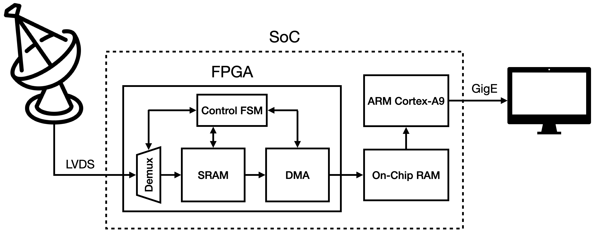
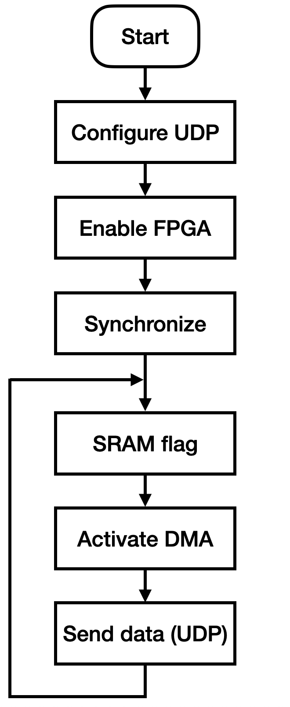

# Data Transmission Through Gigabit Ethernet from a LVDS Interface Using a System On Chip (Single Board Computer + FPGA)


**Anthropometric measurement estimation algorithm:** Block diagram of the LVDS to Gigabit Ethernet data transmission system. The system is implemented on a system-on-chip (SoC), which has a FPGA and a ARM Cortex-A9 microprocessor. Custom hardware created in the FPGA receives data from the LVDS signals and stores it in memory. Then, the processor access the memory and sends the data through Gigabit Ethernet.</p> 

This repository contains the files used to implement the LVDS to Gigabit Ethernet data transmission system, developed in the summer internship program of the Jicamarca Radio Observatory. 

## Description

The objective of this project was to design and implement a system capable of transmitting data at high speeds from the JARS 2.0 radar to a remote computer through Gigabit Ethernet using a system on chip (SoC). The system has two main stages: (i) data acquisition from the LVDS interface and (ii) data transmission to the computer through a communication protocol. In order to acquire data from the LVDS interface, the FPGA was used to implement a system capable of multiplexing and copying the data to a memory shared with the processor. Then, a program running on the processor was used to read the data from memory and send it to the PC with the UDP protocol.

### Hardware

The data transmission system is implemented in DE0-Nano board, which contains a Cyclone V system-on-chip (SoC), consisting of a single-board computer and an FPGA. The microprocessor of the single-board computer is a dual core ARM Cortex-A9. By using the FPGA, users of the DE0-Nano board can develop custom hardware and interact with the GPIO ports. In the FPGA, we implement four hardware blocks: (i) a demultiplexer, (ii) a static random-access memory (SRAM), (iii) a direct memory access (DMA) controller, and (iv) finite state machine (FSM) controller.

The JARS 2.0 system sends 32-bit words at a rate of 1 MHz (256 Mbps). The demultiplexer block is used to separate the words into bytes and store them in the SRAM. The DMA controller has to copy data from the SRAM to the on-chip RAM so that the processor can access and process it. All the FPGA blocks are controlled by a finite state machine, which has to synchronize with the microprocessor and then control the flow of data on the hardware.

### Software

The ARM Cortex-A9 microprocessor uses a Linux distribution, which already has the Ethernet protocol stack implemented. In order to acess the data from the on-chip RAM and send it through Ethernet, we developed a program in C that synchonizes with the FSM controller using flags. The microprocessor accessess the data in the position ```n``` while the DMA writes the next data fragment in the position ```n+1```. This process is able to run in parallel at frequencies of up 150 MHz. The flow diagram of the program implemented on the microprocessor is shown below.

